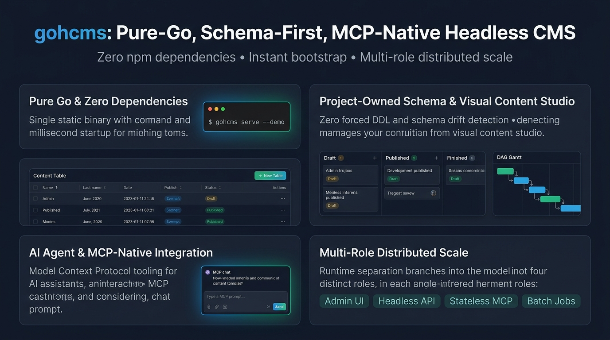

# gohcms ⚡

> **An Exploratory Headless CMS Prototype — Built via Vibe Coding & Agentic Co-Creation.**  
> Exploring Pure-Go performance, Schema Sovereignty, and Native MCP Tooling for AI Agents.

[](#-the-philosophy-vibe-coding--architecture-exploration)
[](#-project-status--production-readiness)
[](https://goreportcard.com/report/github.com/yutapok/gohcms)
[](LICENSE)

> [!WARNING]
> **Project Status: Experimental Prototype (v0.3.x)**  
> `gohcms` は現在、Go 言語と AI/MCP 連携の新しい設計思想を探求する **実験的プロトタイプ（Proof-of-Concept）** です。  
> コア API、CLI オプション、スキーマ定義の仕様は今後予告なく変更される可能性があり、**現時点での本番環境（Production）への導入は推奨いたしません**。ローカル環境での試用、AI エージェント運用のプロトタイピング、機能検証、アイデアのディスカッション・Issue を心より歓迎します！

<p align="center">
  
</p>

---

## 💡 The Philosophy: Vibe Coding & Architecture Exploration

`gohcms` は、エンタープライズ向けの完成された製品を目指して作られたものではありません。  
AI Agent と人間が **Vibe Coding（直感と対話によるアジャイルな高速共創）** を通じて、**「AI 時代の Headless CMS は本来どう設計されるべきか？」というアイデアを探求・具現化した実験的プロトタイプ** です。

### 探求した 3 つのアイデア仮説：
1. **🚀 なぜ CMS は巨大な Node.js と重たいビルドを要求するのか？**  
   → Go のシングルバイナリ 1 つで、ゼロ npm 依存・ミリ秒起動・低脆弱性な超軽量基盤が作れるのではないか？
2. **🛡️ なぜ CMS が既存のデータベース構造を勝手に書き換えるのか？**  
   → DB スキーマの主権はプロジェクトが握り、CMS は差分（ドリフト）を検知して寄り添うだけで十分ではないか？
3. **🤖 AI エージェントが日常的にコンテンツを運用する時代、CMS の UI はどうあるべきか？**  
   → 人間向けのカンバン/ガントと、AI 向けの MCP (Model Context Protocol) ツールを同じ DB 上でデュアルトラック運用できるのではないか？

本リポジトリのコードやアーキテクチャが、開発者やコミュニティの皆様にとって **「次世代のバックエンドと AI 運用のインスピレーション」** となれば幸いです。

---

## 🚧 Project Status & Production Readiness

現在 `gohcms` は **v0.3.0 (Alpha)** です。以下のマイルストーンに沿って開発を進めています：

| 機能領域 | 現在のステータス (v0.3.x) | 本番向けロードマップ (v1.0) |
|---|---|---|
| **コアエンジン** | ✅ スキーマドリフト検知・3-State ライフサイクル・監査ログ | 🔄 プラグイン機構・カスタムイベントフック |
| **データベース** | ✅ PostgreSQL アダプタ & インメモリ/ファイル同期デモ | 🔄 SQLite / MySQL / DuckDB サポート |
| **AI / MCP** | ✅ stdio 経由のコンテンツ操作・調査ツール | 🔄 SSE (Server-Sent Events) / 外部 MCP 連携 |
| **認証・認可** | ⚠️ Basic 認証 & API Key（単一組織向け） | 🔄 RBAC (細粒度権限管理) & OAuth2 / OIDC |
| **メディア管理** | ⚠️ ローカルディスク保存 & Basic MIME チェック | 🔄 S3 / GCS オブジェクトストレージ & 画像リサイズ |
| **耐障害性・運用** | ⚠️ 単一プロセス / メモリストア | 🔄 レートリミット、Prometheus メトリクス、分散キャッシュ |

---

## 🌟 3 Core Pillars of gohcms

### 1. 🚀 Pure Go & Zero-Dependency Speed
- **脱 Node.js & ゼロ npm 依存**: `node_modules` の数万個のファイルやサプライチェーン脆弱性（npm CVE）から完全に解放。
- **シングルバイナリ & ミリ秒起動**: CGO 無効化の静的 Go バイナリ。メモリ消費が極めて小さく、コンテナも数 MB サイズで超高速起動・スケール。
- **0 秒ブートストラップ**: PostgreSQL や Docker が手元になくても `gohcms serve --demo` で即座に管理画面と REST API が立ち上がります。

---

### 2. 🛡️ Project-Owned Schema & Visual Content UI
- **スキーマ主権 & ゼロ強制 DDL**: データベースの主権はあなたのアプリケーションプロジェクトが握ります。CMS が勝手に DDL や自動マイグレーションを実行して既存テーブルを破壊することはありません。YAML 宣言との差分を「スキーマドリフト」として検証・検知し、安全に共存します。
- **3-State Kanban Board**: `Draft` ↔ `Published` → `Finished` の進行状態をドラッグ＆ドロップで直感管理。
- **DAG Gantt Timeline**: 「前提記事が公開されるまで公開できない」といったタスク依存関係（DAG）や、公開日・終了予定日をガントチャートで視覚的に把握。

---

### 3. 🤖 AI Agent & MCP-Native Integration
- **AI の手足となる MCP (Model Context Protocol)**: Claude や IDE、自律エージェントが、API 仕様書を調べることなく stdio 経由で直接コンテンツの作成・更新・スキーマ調査・デバッグを自然言語で実行。
- **人間と AI の協調運用**: 人間はモダンな Web 管理画面から、AI は MCP ツールから同時に操作し、同一の監査ログ（Audit Trail）とリビジョン履歴に安全に記録。
- **1 バイナリからの分散ロール分離（Multi-Role Runtime）**: 1 つのバイナリが起動フラグだけで変幻自在に役割を分離：
  - `--role=api`: 大規模トラフィックを捌く公開 Headless REST API
  - `--role=admin`: 社内 VPN や認証で保護されたセキュアな Admin UI
  - `gohcms mcp`: AI エージェント専用のステートレス通信
  - `gohcms job`: バッチや定期実行（公開予約など）のための One-shot Job ランナー

---

## 🚀 Quickstart Guide

### 1. インストール & ビルド

```bash
# クローン
git clone https://github.com/yutapok/gohcms.git
cd gohcms

# CLI バイナリのビルド
go build -o gohcms ./cmd/cms
```

---

### 2. 即座に Admin UI を試す（DB・Docker 不要）

```bash
./gohcms serve --demo --schema-dir ./examples/article --port 8080
```

ブラウザで **[http://localhost:8080/](http://localhost:8080/)** を開くと、以下をすぐに体験できます：
- **📌 Kanban Board**: `[ Draft ]` | `[ Published ]` | `[ Finished ]` のカードをドラッグ＆ドロップでステータス変更。
- **⏳ Timeline View**: `published_at`（公開日）や `depends_on`（先行タスク）の依存関係ライン。
- **🖼️ Media Library**: 画像ファイルのアップロード、サムネイル一覧、コンテンツ編集時のプレビュー付きピッカー。
- **🔑 API Keys**: Headless REST API 用の Bearer Token / API Key 発行・無効化。
- **📋 Table View**: コンテンツの CRUD、インラインアクション、クイックフィルタ。
- **📜 History Modal**: 各記事の変更トランザクション監査ログと過去バージョンのスナップショット。

---

### 3. AI Agent / MCP Server 連携 (`gohcms mcp`)

Claude Desktop や Cursor / Antigravity 等の MCP クライアント設定（`.mcp.json` / `claude_desktop_config.json`）に登録します：

```json
{
  "mcpServers": {
    "gohcms": {
      "command": "/path/to/gohcms",
      "args": ["mcp", "--demo", "--schema-dir", "/path/to/resources"]
    }
  }
}
```

AI に以下のように指示するだけで、ツールを自動選択してコンテンツ管理・調査が実行されます：
- *"現在の記事一覧とステータスを教えて"* (`cms_content_list`)
- *"Go言語の入門記事をドラフトで作成して"* (`cms_content_mutate`)
- *"記事 art-ch1 を公開状態にして"* (`cms_content_publish`)
- *"DBスキーマと定義ファイルに不整合がないか調べて"* (`cms_schema_drift`)

---

### 4. Headless REST API (`/api/*`) & OpenAPI 3.1

```bash
# 記事一覧の取得 (公開済み記事のみ)
curl -H "Authorization: Bearer gohcms_live_..." http://localhost:8080/api/article

# 記事の作成 (ドラフト)
curl -X POST -H "Content-Type: application/json" \
  -H "Authorization: Bearer gohcms_live_..." \
  -d '{"title":"Hello gohcms","body":"Created via REST"}' \
  http://localhost:8080/api/article

# OpenAPI 3.1.0 JSON 仕様のエクスポート
./gohcms openapi export --file ./examples/article/article.yaml
```

---

## 🔒 Production Deployment & Security Best Practices

### 1. プロセス分離（Runtime Role Separation）
- **公開 Web / モバイル向け**: `--role=api` で起動し、Headless REST API と画像配信のみを公開します（Admin UI は 404 になり露出されません）。
  ```bash
  gohcms serve --role=api --port 8081 --db "$DATABASE_URL" --schema-dir ./resources
  ```
- **社内管理画面（Admin UI）**: `--role=admin` で起動し、社内 VPN、Tailscale、またはリバースプロキシの背後に配置します。
  ```bash
  gohcms serve --role=admin --port 8080 --db "$DATABASE_URL" --schema-dir ./resources \
    --admin-user "admin" --admin-password "$ADMIN_PASSWORD"
  ```

### 2. 認証・認可の徹底
- **Admin UI 認証**: `ADMIN_USER` / `ADMIN_PASSWORD`（または `--admin-user` / `--admin-password`）を設定して Basic 認証を有効化します。未設定の場合はパブリック環境に直接公開しないでください。
- **REST API 認証**: `STATIC_API_KEY`（または `--api-key`）を設定するか、Admin UI の「API Keys」画面からスコープ付き API キー（Read / Read-Write）を発行して保護します。

### 3. メディア配信セキュリティ
- 画像配信（`/media/{id}`）は `Cache-Control: private, max-age=3600, no-transform` および `X-Content-Type-Options: nosniff` を標準付与します。
- 安全な標準画像フォーマット（JPEG, PNG, WebP, GIF, AVIF）はインライン表示され、SVG や HTML などのスクリプト実行リスクがあるファイル形式は自動的に `Content-Disposition: attachment` および CSP サンドボックスが付与されて配信されます。

---

## 🧪 テストの実行

```bash
# 全パッケージの単体・HTTP・E2E・CLI Contract テストを実行（データ競合ゼロ）
go clean -testcache && go test -race -count=1 ./...
```

---

## 📄 License & Attribution

- **License**: This project is licensed under the [MIT License](LICENSE).
- **Artwork & Provenance**: Visual infographics in `assets/` were generated with Google AI and contain [SynthID](https://deepmind.google/technologies/synthid/) & [C2PA](https://c2pa.org/) content credentials verifying provenance and authenticity.
- **Third-Party Notices**: For complete notices and licenses of dependencies, frontend libraries (SortableJS, HTMX), and typography (Inter, JetBrains Mono), see [THIRD_PARTY_LICENSES.md](THIRD_PARTY_LICENSES.md).
